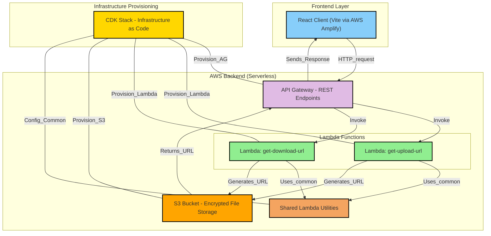

# SafeSend

A secure file transfer application built with AWS CDK, TypeScript, and React. This project provides a secure way to upload and download files using pre-signed URLs and AWS S3.

## Project Structure

- `/client` - React frontend application built with Vite
- `/lambda` - AWS Lambda functions for handling file operations
  - `/handlers` - Lambda function handlers for upload and download URL generation
  - `/common` - Shared code between Lambda functions
  - `/types` - TypeScript type definitions
- `/lib` - CDK infrastructure code
  - `safesend-stack.ts` - Main CDK stack defining AWS resources
- `/bin` - CDK app entry point
- `/test` - Test files for the infrastructure and Lambda functions

## Prerequisites

- Node.js (v20 or later)
- AWS CLI configured with appropriate credentials
- npm or yarn package manager

## Setup and Installation

1. Install backend dependencies:
```bash
npm install
```

2. Install frontend dependencies:
```bash
cd client
npm install
```

3. Configure your environment variables:
- Copy `.env.example` to `.env` in both the root directory and client directory
- Set up necessary AWS credentials and API endpoints

## Development Commands

### Backend (CDK)

* `npm run build`   - Compile TypeScript to JavaScript
* `npm run watch`   - Watch for changes and compile
* `npm run test`    - Run Jest unit tests
* `npx cdk deploy`  - Deploy the stack to your AWS account/region
* `npx cdk diff`    - Compare deployed stack with current state
* `npx cdk synth`   - Emit the synthesized CloudFormation template

### Lambda Testing

* `npm run local-upload-lambda`   - Test the upload Lambda function locally
* `npm run local-download-lambda` - Test the download Lambda function locally

### Frontend (Client)

From the `client` directory:

* `npm run dev`     - Start the development server
* `npm run build`   - Build for production
* `npm run preview` - Preview production build locally

## Deployment

### Backend Deployment

The backend infrastructure is deployed using AWS CDK:

```bash
npx cdk deploy
```

### Frontend Deployment

The client application is deployed using AWS Amplify:

1. Connect your GitHub repository to AWS Amplify through the AWS Console
2. Configure the build settings to use the following commands:
   - Build command: `npm run build`
   - Output directory: `dist`
3. Set up environment variables in the Amplify Console
   - `AMPLIFY_MONOREPO_APP_ROOT`: `client`
   - `VITE_API_ENDPOINT`: Endpoint URL value outputted from your CDK deploy
4. Configure automatic deployments from the main branch

When changes are pushed to the main branch, Amplify will automatically build and deploy the updated client application.

## Architecture

This application uses the following AWS services:

- **S3 Bucket**: Stores uploaded files with automatic expiration
- **Lambda Functions**: Generate pre-signed URLs for secure uploads and downloads
- **API Gateway**: Provides RESTful endpoints for the Lambda functions
- **IAM**: Manages permissions between services
- **Amplify**: Hosts and deploys the frontend application

The application implements secure file transfer using AWS pre-signed URLs and S3 bucket policies. All file transfers are encrypted in transit and at rest.



## Configuration

The application can be configured through the following parameters:

- `allowedOrigins`: List of allowed CORS origins
- `expirationDays`: Number of days before files are automatically deleted
- `maxFileSize`: Maximum allowed file size for uploads