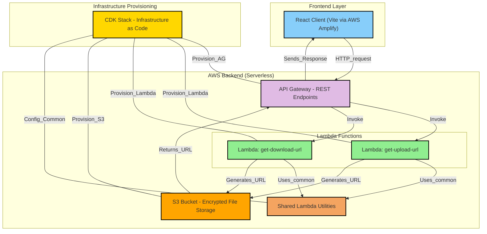

# SafeSend

A secure file transfer application built with AWS CDK, TypeScript, and React. This project provides a secure way to upload and download files using pre-signed URLs and AWS S3.

## Project Structure

- `/client` - React frontend application
- `/lambda` - AWS Lambda functions for file operations
- `/lib` - CDK infrastructure code
- `/bin` - CDK app entry point
- `/test` - Test files

## Development Commands

### Backend (CDK)

* `npm run build`   - Compile TypeScript
* `npm run watch`   - Watch and compile
* `npm run test`    - Run tests
* `npx cdk deploy`  - Deploy stack
* `npx cdk diff`    - Compare stack
* `npx cdk synth`   - Emit CloudFormation template

### Lambda Testing

* `npm run local-upload-lambda`   - Test upload Lambda locally
* `npm run local-download-lambda` - Test download Lambda locally

### Frontend (Client)

From the `client` directory:

* `npm run dev`     - Start development server
* `npm run build`   - Build for production
* `npm run preview` - Preview production build

## Deployment

### Prerequisites

1. AWS account with appropriate permissions
2. AWS CLI installed and configured
3. Node.js v20+
4. npm package manager

### Initial Setup

1. Clone the repository:
```bash
git clone https://github.com/PBlanco/SafeSend.git 
cd SafeSend
```

2. Install dependencies:
```bash
# Backend
npm install

# Frontend
cd client
npm install
cd ..
```

3. Set up AWS Amplify hosting:
   - Create a new app in [AWS Amplify Console](https://us-east-1.console.aws.amazon.com/amplify/apps)
   - Connect to your GitHub repository
   - Configure build settings:
     - Build command: `npm run build`
     - Output directory: `dist`
     - Base directory: `client`

4. Configure backend environment:
   - Create a `.env` file based on `.env.example`:
   ```bash
   ALLOWED_ORIGINS=https://your-amplify-domain.amplifyapp.com
   MAX_FILE_SIZE=5242880  # 5MB default
   ```

5. Deploy backend:
```bash
npx cdk deploy
```
   - Note API Gateway URL and S3 Bucket Name from outputs

6. Update environment variables:
   - Root `.env`:
   ```bash
   BUCKET_NAME=your-s3-bucket-name-from-cdk-output
   ```
   
   - `client/.env`:
   ```bash
   VITE_API_ENDPOINT=https://your-api-gateway-url.execute-api.region.amazonaws.com/prod/
   ```
   
   - Add in AWS Amplify Console:
   ```
   Branch: All Branches
   Variable: VITE_API_ENDPOINT
   Value: https://your-api-gateway-url.execute-api.region.amazonaws.com/prod/
   ```

7. Deploy frontend:
   - Push to GitHub or manually deploy from Amplify Console

8. Verify deployment by testing upload/download functionality

### Ongoing Deployments

#### Backend Updates

1. Make changes to backend code
2. Run `npx cdk diff` to review changes
3. Deploy with `npx cdk deploy`
4. Update environment variables if endpoints change

#### Frontend Updates

Push to GitHub repository - Amplify will automatically build and deploy

## Local Development

1. Update backend environment for local development:
```bash
# Update your root .env file to include localhost
ALLOWED_ORIGINS=https://your-amplify-domain.amplifyapp.com,http://localhost:5173
```

2. Redeploy backend to apply CORS changes:
```bash
npx cdk deploy
```

3. Start frontend:
```bash
cd client
npm run dev
```

4. Test Lambda functions:
```bash
npm run local-upload-lambda
npm run local-download-lambda
```

## Architecture

This application uses:

- **S3 Bucket**: File storage with expiration
- **Lambda Functions**: Generate pre-signed URLs
- **API Gateway**: REST endpoints
- **IAM**: Service permissions
- **Amplify**: Frontend hosting

All file transfers are encrypted in transit and at rest.



## Configuration

The CDK Stack can be configured through the following parameters:

- `allowedOrigins`: CORS origins (default: from env.ALLOWED_ORIGINS)
- `expirationDays`: Days before files auto-delete (default: 7)
- `maxFileSize`: Maximum allowed file size in bytes (default: from env.MAX_FILE_SIZE or 5MB)
- `stageName`: API Gateway stage name (default: 'prod')
- `logRetentionDays`: CloudWatch log retention period (default: 30)

## Security

SafeSend implements several security measures:

- **Pre-signed URLs**: Temporary, scoped access for uploads/downloads
- **S3 Encryption**: Server-side encryption (SSE-S3)
- **CORS Configuration**: Restricts origins that can access the API
- **File Expiration**: Automatic deletion of files after configured period
- **No Public Access**: S3 bucket blocks all public access by default
- **IAM Role Separation**: Principle of least privilege for Lambda functions

## Troubleshooting

### CORS Issues
- Verify `ALLOWED_ORIGINS` in `.env` matches your frontend URL
- Check API Gateway CORS configuration
- Ensure pre-flight (OPTIONS) requests work properly

### Upload Failures
- Check file size against `MAX_FILE_SIZE` limit
- Validate Lambda execution role has S3 permissions
- Review CloudWatch logs for Lambda errors

### Download Issues
- Verify file exists in S3 bucket
- Check file hasn't expired (default: 7 days)
- Ensure correct file ID is being requested
