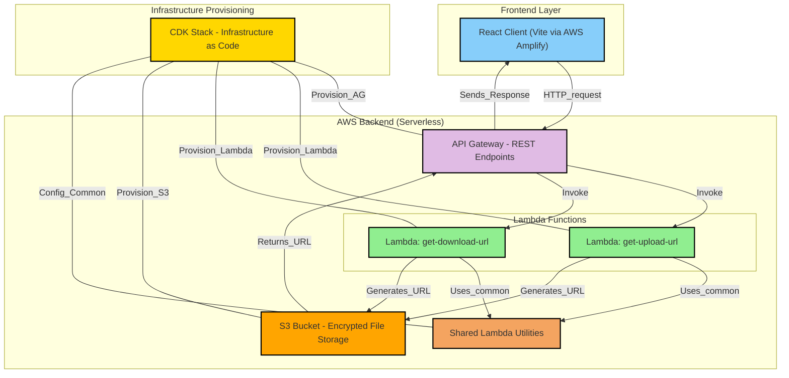

# SafeSend

A secure file transfer application built with AWS CDK, TypeScript, and React. This project provides a secure way to upload and download files using pre-signed URLs and AWS S3.

## Project Structure

- `/client` - React frontend application built with Vite
- `/lambda` - AWS Lambda functions for handling file operations
  - `/handlers` - Lambda function handlers for upload and download URL generation
  - `/common` - Shared code between Lambda functions
  - `/types` - TypeScript type definitions
- `/lib` - CDK infrastructure code
  - `safesend-stack.ts` - Main CDK stack defining AWS resources
- `/bin` - CDK app entry point
- `/test` - Test files for the infrastructure and Lambda functions

## Development Commands

### Backend (CDK)

* `npm run build`   - Compile TypeScript to JavaScript
* `npm run watch`   - Watch for changes and compile
* `npm run test`    - Run Jest unit tests
* `npx cdk deploy`  - Deploy the stack to your AWS account/region
* `npx cdk diff`    - Compare deployed stack with current state
* `npx cdk synth`   - Emit the synthesized CloudFormation template

### Lambda Testing

* `npm run local-upload-lambda`   - Test the upload Lambda function locally
* `npm run local-download-lambda` - Test the download Lambda function locally

### Frontend (Client)

From the `client` directory:

* `npm run dev`     - Start the development server
* `npm run build`   - Build for production
* `npm run preview` - Preview production build locally

## Deployment

### Prerequisites

Before deploying, ensure you have:
1. An AWS account with appropriate permissions
2. AWS CLI installed and configured with your credentials
3. Node.js v20 or later installed
4. npm package manager

### Initial Setup

1. Clone the repository:
```bash
git clone https://github.com/PBlanco/SafeSend.git 
cd SafeSend
```

2. Install dependencies:
```bash
# Install backend dependencies
npm install

# Install frontend dependencies
cd client
npm install
cd ..
```

3. Set up AWS Amplify hosting:
   - Navigate to the [AWS Amplify Console](https://us-east-1.console.aws.amazon.com/amplify/apps)
   - Create a new app and connect it to your GitHub repository
   - Configure the build settings:
     - Build command: `npm run build`
     - Output directory: `dist`
     - Base directory: `client`

4. Configure backend environment variables:
   - Create a `.env` file in the root directory based on `.env.example`:
   ```bash
   ALLOWED_ORIGINS=https://your-amplify-domain.amplifyapp.com
   MAX_FILE_SIZE=5242880  # 5MB default, adjust if needed
   # You'll add the bucket name after CDK deployment
   ```

5. Deploy the backend infrastructure:
```bash
npx cdk deploy
```
   - Note the output values which you'll need:
     - API Gateway URL
     - S3 Bucket Name

6. Update environment variables with deployment outputs:
   - Update your root `.env` file with the S3 bucket name:
   ```bash
   BUCKET_NAME=your-s3-bucket-name-from-cdk-output
   ```
   
   - Create a `client/.env` file based on `client/.env.example`:
   ```bash
   VITE_API_ENDPOINT=https://your-api-gateway-url.execute-api.region.amazonaws.com/prod/
   ```
   
   - Add [environment variables](https://docs.aws.amazon.com/amplify/latest/userguide/setting-env-vars.html) in the AWS Amplify Console:
   ```
   Branch: All Branches
   Variable: VITE_API_ENDPOINT
   Value: https://your-api-gateway-url.execute-api.region.amazonaws.com/prod/
   ```

7. Trigger a deployment of the frontend:
   - Push a change to the main branch of the connected GitHub repository, or
   - Manually redeploy from the Amplify Console

8. Verify deployment:
   - Check that the frontend is accessible at your Amplify domain
   - Test file upload and download functionality
   - Verify CORS is working correctly

### Ongoing Deployments

#### Backend Updates

For backend changes (Lambda functions, API Gateway, S3 configurations):

1. Make your changes to the backend code
2. Inspect changes using CDK: `npx cdk diff`
3. Deploy updates using CDK: `npx cdk deploy`
4. If API endpoints change, update the environment variables in:
   - Your local `client/.env` (for development)
   - AWS Amplify Console (for production)

#### Frontend Updates

Frontend changes are automatically deployed when you push to the main branch:

1. Make your changes to the frontend code
2. Commit and push to your GitHub repository
3. Amplify will automatically detect the changes, build, and deploy the updated frontend

### Local Development

To work on the project locally:

1. Start the frontend development server:
```bash
cd client
npm run dev
```

2. For testing Lambda functions locally:
```bash
npm run local-upload-lambda
npm run local-download-lambda
```


## Architecture

This application uses the following AWS services:

- **S3 Bucket**: Stores uploaded files with automatic expiration
- **Lambda Functions**: Generate pre-signed URLs for secure uploads and downloads
- **API Gateway**: Provides RESTful endpoints for the Lambda functions
- **IAM**: Manages permissions between services
- **Amplify**: Hosts and deploys the frontend application

The application implements secure file transfer using AWS pre-signed URLs and S3 bucket policies. All file transfers are encrypted in transit and at rest.



## Configuration

The CDK Stack can be configured through the following parameters:

- `allowedOrigins`: List of allowed CORS origins
- `expirationDays`: Number of days before files are automatically deleted
- `maxFileSize`: Maximum allowed file size for uploads